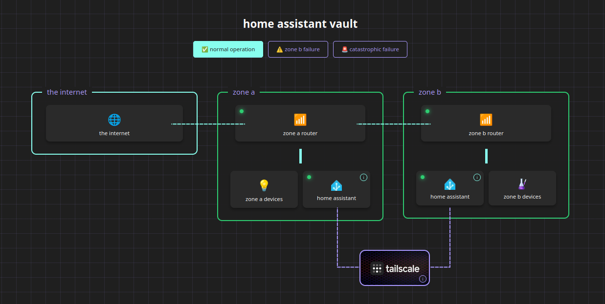

# home assistant vault: isolation visualizer

this is a lightweight, interactive map built to show parents (and anyone else who still thinks 'online' equals 'hacked') exactly how a resilient home network works.

i wanted to share this because a large portion of the community will set up an instance for their elderly or handicapped family members and this is to alleviate some of the distrust and ease the process by providing easy to understand, interactive study material you can let them use when they're ready. i have a family member that got frustrated when i would try to explain the safety of it to them because even "the internet can be safe" can be confusing enough to cause a shut down. 

---

 

  

  

most people assume that if i can see my house on my phone, then a hacker can too. this tool is designed to dismantle that fear by visually proving the difference between a public front door and a private, encrypted vault.

🚀 why it exists
- prove isolation: show that zone b (your lab/mess) is physically and logically separated from zone a (their house). if your stuff breaks, their stuff stays green.

- the bouncer metaphor: explains tailscale as a hidden trapdoor guarded by a bouncer, rather than an open window.

- the local-first pitch: highlights that home assistant is a local vault, not a cloud-based vulnerability.

🛠 features

- simulated failures: buttons to trigger 'zone b failure' or 'catastrophic failure' so they can see the lights go red and the flow stop without the rest of the house blowing up.

- mobile-friendly: unrestrained zoom support so you can pull this up on a phone and pinch-out to show the whole architecture during a conversation.

- simple tooltips: 'i' circles that translate technical jargon into plain english metaphors.

📂 how to use

- clone or git pull repo

- open home-assistant-vault.html in a browser. no server or hosting required.

required assets in folder:

home-assistant-vault:

  - home-assistant-vault.html

  - home-assistant-vault/assets:

    - ha-icon.webp

    - lab.png

    - tailscale.webp

    - vault.png

<h3>future</h3>

adapt for proper mobile view

---

📜 license

open source (mit). fork it, fix it, use it to win your next argument about why there is a server in the guest room.
